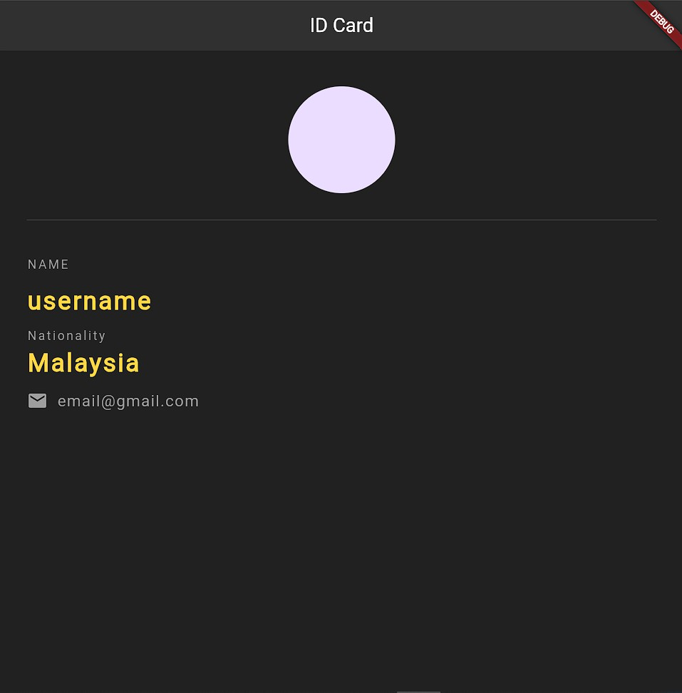

# Identification Card using Flutter

Basic flutter playing with MaterialApp widget

# Flutter ID Card App

A simple Flutter application that displays a digital ID card with personal information.

## Description

This application is a digital ID card built using Flutter. It showcases basic user information including:
- Profile picture
- Name
- Nationality
- Email contact

## Features

- Clean and modern UI design
- Dark theme
- Responsive layout
- Contact information display

## Screenshots

<div allign = "center">

</div>

## Getting Started

### Prerequisites

- Flutter SDK
- Dart SDK
- Any IDE with Flutter support (VS Code, Android Studio, etc.)

### Installation

1. Clone the repository
```bash
git clone https://github.com/your-username/identification_card.git
```

2. Navigate to project directory
```bash
cd identification_card
```

3. Get dependencies
```bash
flutter pub get
```

4. Run the app
```bash
flutter run
```

## Project Structure

```
identification_card/
  ├── assets/
  │   └── psp.png
  ├── lib/
  │   └── main.dart
  └── pubspec.yaml
```

## Dependencies

- Flutter SDK
- Material Design

## Contributing

Feel free to submit issues and enhancement requests.

## License

This project is licensed under the MIT License - see the LICENSE file for details
